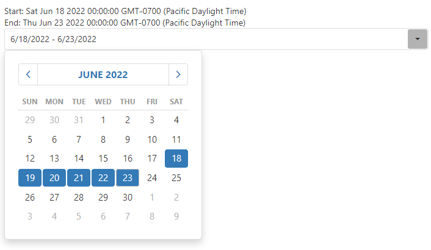

<!-- default badges list -->

<!-- default badges end -->
# DevExtreme - How to create a date range picker
This example demonstrates how to create a simple date range picker using [DropDownBox](https://js.devexpress.com/Documentation/Guide/UI_Components/DropDownBox/Getting_Started_with_DropDownBox/) and [Calendar](https://js.devexpress.com/Documentation/Guide/UI_Components/Calendar/Getting_Started_with_Calendar/).

